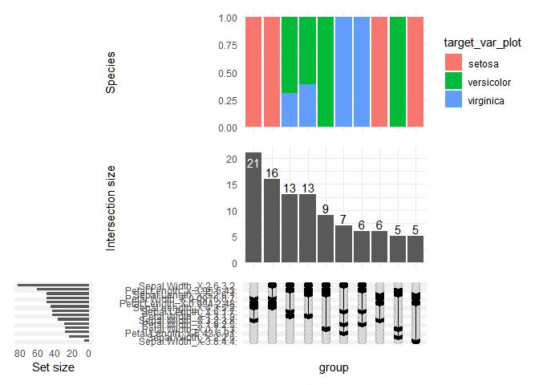
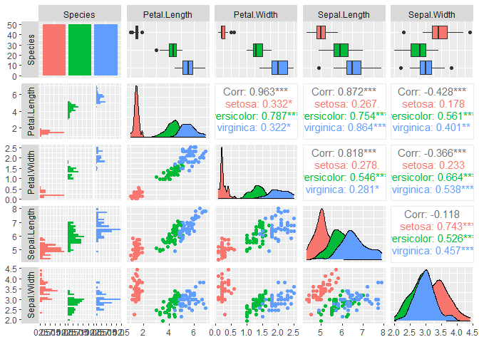
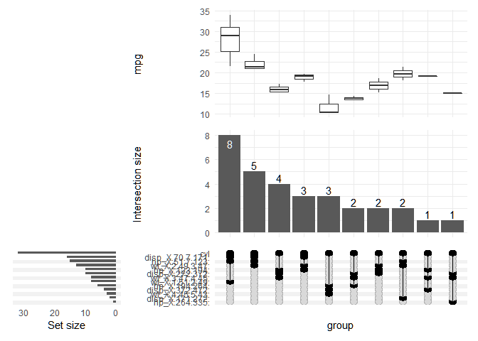
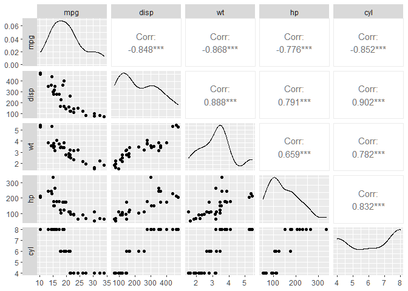
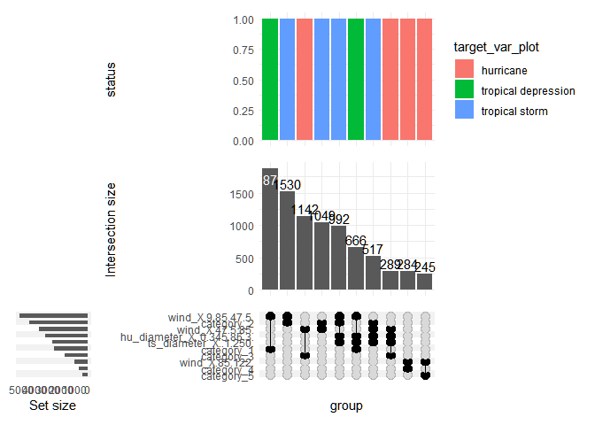
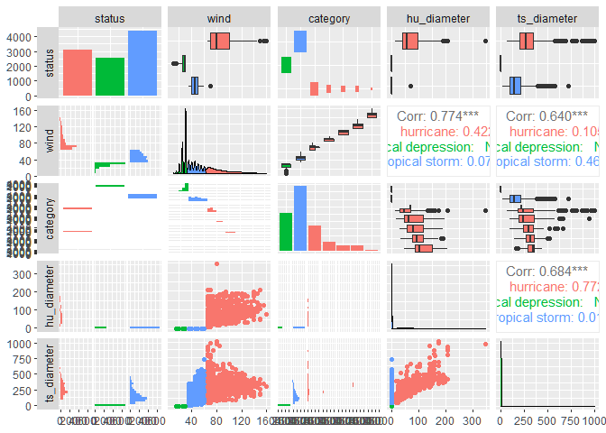

<!-- README.md is generated from README.Rmd. Please edit that file -->

# Modeling-Oriented Exploratory Data Analysis (MOEDA) - Finally, At a Glance Useful EDA

Modeling-Oriented Exploratory Data Analysis (MOEDA) is a novel approach
to EDA, which aims to make you quickly understand how useful your data
is in modelling a target variable. This gives any data analyst or
scientist an immediate feel of what can be expected from the data when
taken through ML or statistical modelling initiatives. It addresses the
main shortcomings of traditional EDA which tells you what the data is
(how many variables of each type, how many nulls, etc.) instead of how
useful it is. MOEDA also challenges “automatic” EDA approaches, which
only automate the creation of dozens of charts without immediately
surfacing the cons and pros of your explanatory variables.

## Installation and Usage Disclaimers

MOEDA is still in its infancy so if you want to jump on board prepare
for a bumpy road ahead. Although the idea for this method was brewing in
my head for a while and I use the package daily, currently I consider
this package usable only in a personal context. The ambition is of
course to move it to CRAN when it matures. If you are fine with all of
that, fire away:

``` r
devtools::install_github("jarekkupisz/MOEDA")
```

## Usage example

For a detailed explanation about the method please continue reading to
the next paragraph. The package exports a single function. To use you
typically only need to provide the target variable name as a string or
unquoted (especially useful in a tidyverse piping context). You don’t
need to worry about the rest.

``` r
library(dplyr)
library(MOEDA)
iris %>% moeda(Species)
#> Fitting a simple random forest model, this might take some time...
#> # A tibble: 4 x 5
#>   variable_name permutation_importance perc_share cum_perc perc_diff
#>   <chr>                          <dbl>      <dbl>    <dbl>     <dbl>
#> 1 Petal.Length                 0.313      0.501      0.501     NA   
#> 2 Petal.Width                  0.271      0.434      0.935     -0.15
#> 3 Sepal.Length                 0.0348     0.0558     0.991     -6.77
#> 4 Sepal.Width                  0.00579    0.00928    1         -5.01
#> # A tibble: 2 x 3
#>   .metric  .estimator .estimate
#>   <chr>    <chr>          <dbl>
#> 1 accuracy multiclass     0.967
#> 2 kap      multiclass     0.948
#> Printing an upset plot with MOEDA intersections of top vars. Please browse back in the plots output pane if you wish to see it.
#> Printing a GGally::ggpairs of target variable and top features.
```



    #> Returning moedized data across n_top_vars



    #> # A tibble: 150 x 10
    #>    Sepal.Length Sepal.Width Petal.Length Petal.Width Species Petal.Length_moedi~
    #>           <dbl>       <dbl>        <dbl>       <dbl> <fct>   <fct>              
    #>  1          5.1         3.5          1.4         0.2 setosa  [0.994,2.48]       
    #>  2          4.9         3            1.4         0.2 setosa  [0.994,2.48]       
    #>  3          4.7         3.2          1.3         0.2 setosa  [0.994,2.48]       
    #>  4          4.6         3.1          1.5         0.2 setosa  [0.994,2.48]       
    #>  5          5           3.6          1.4         0.2 setosa  [0.994,2.48]       
    #>  6          5.4         3.9          1.7         0.4 setosa  [0.994,2.48]       
    #>  7          4.6         3.4          1.4         0.3 setosa  [0.994,2.48]       
    #>  8          5           3.4          1.5         0.2 setosa  [0.994,2.48]       
    #>  9          4.4         2.9          1.4         0.2 setosa  [0.994,2.48]       
    #> 10          4.9         3.1          1.5         0.1 setosa  [0.994,2.48]       
    #> # ... with 140 more rows, and 4 more variables: Petal.Width_moedized <fct>,
    #> #   Sepal.Length_moedized <fct>, Sepal.Width_moedized <fct>,
    #> #   moeda_intersections <chr>

## Why MOEDA?

In my daily work as a data scientist and/or analyst I was tired of the
same scenario repeating all over again. You get some data and you try to
do some EDA on it with typically multiple tools and packages. You
diligently plot your distribution, correlation and other plots trying to
take in as much information as possible. After some time you discover
that these plots were mostly useless, as there are only a few variables
in the dataset that matter for modelling your target variable. I’ve done
a thorough review of EDA tools and approaches and there are several main
problems I noticed:

1.  Spitting out a dozen of charts is only useful if you have no idea
    about the dataset nor how it was generated, which is not common in
    daily work as you typically have some knowledge about your company
    and its data 😊
2.  Even if you have a nice EDA procedure that generates all these basic
    charts efficiently, you lose time trying to discern any meaning,
    which only comes typically after torturing the data in subsequent
    tasks like modelling or making reports.
3.  If a dataset has flaws (like a lot of missing values) it should
    become visible immediately when you try to use it. Let’s remember
    that any data is only a tool to achieve the desired outcome, hence
    listing data properties with typical EDA approaches does not bring
    you directly closer to your goal.

## What is the vision?

The vision for MOEDA is to produce a single chart with a single function
call that will tell you how useful your data is in ML. The idea behind
the method is to select the variables that have the most influence on
the dependent variable and visualize their groupings using upset style
visualization.

The selection of variables is done by measuring the random forest
permutation variable importance. This method ensures that the selected
variables truly hold predictive power and it is reasonably fast. Also,
it is criminally underused in times when for some reason many think that
algorithm selection and tuning give you any bank for your buck.

## How does it work currently?

The visualization part is not yet finalized as I am still figuring the
best output. Currently, if you run `moeda()` the following things
happen:

1.  A random forest is run on the training set with 80% of observations
2.  Permutation variable importance is exported from the model and
    reported to the console together with some additional information
3.  Model’s performance is assessed on the test set of the remaining 20%
    of observations and reported to the console
4.  Top variables (their number can be specified with `n_top_vars`
    argument) are discretized using equal widths discretization via
    `base::cut()`. You can select the number of cuts with the `cuts`
    argument.
5.  An upset plot of the intersections from 4. together with target
    variables is printed.
6.  A `GGally::ggpairs()` plot of top variables is printed.
7.  The function returns the original `df` and joins top features
    columns that were cut together with resulting intersections. These
    additional columns have `moedized` in their name.

The function uses NSE so you can provide your target variable without
quotation marks. It supports both regression and classification. Usage
examples:

``` r
moeda(mtcars, mpg)
#> Fitting a simple random forest model, this might take some time...
#> # A tibble: 10 x 5
#>    variable_name permutation_importance perc_share cum_perc perc_diff
#>    <chr>                          <dbl>      <dbl>    <dbl>     <dbl>
#>  1 disp                          11.8       0.266     0.266     NA   
#>  2 wt                            11.7       0.263     0.529     -0.01
#>  3 hp                             9.15      0.206     0.735     -0.27
#>  4 cyl                            6.32      0.143     0.878     -0.45
#>  5 drat                           1.46      0.0330    0.911     -3.32
#>  6 carb                           1.21      0.0272    0.938     -0.21
#>  7 am                             1.03      0.0232    0.961     -0.17
#>  8 qsec                           0.629     0.0142    0.975     -0.64
#>  9 vs                             0.564     0.0127    0.988     -0.12
#> 10 gear                           0.538     0.0121    1         -0.05
#> # A tibble: 3 x 3
#>   .metric .estimator .estimate
#>   <chr>   <chr>          <dbl>
#> 1 rmse    standard       2.12 
#> 2 rsq     standard       0.923
#> 3 mae     standard       1.81
#> Printing an upset plot with MOEDA intersections of top vars. Please browse back in the plots output pane if you wish to see it.
#> Printing a GGally::ggpairs of target variable and top features.
```



    #> Returning moedized data across n_top_vars



    #> # A tibble: 32 x 16
    #>      mpg   cyl  disp    hp  drat    wt  qsec    vs    am  gear  carb
    #>    <dbl> <dbl> <dbl> <dbl> <dbl> <dbl> <dbl> <dbl> <dbl> <dbl> <dbl>
    #>  1  21       6  160    110  3.9   2.62  16.5     0     1     4     4
    #>  2  21       6  160    110  3.9   2.88  17.0     0     1     4     4
    #>  3  22.8     4  108     93  3.85  2.32  18.6     1     1     4     1
    #>  4  21.4     6  258    110  3.08  3.22  19.4     1     0     3     1
    #>  5  18.7     8  360    175  3.15  3.44  17.0     0     0     3     2
    #>  6  18.1     6  225    105  2.76  3.46  20.2     1     0     3     1
    #>  7  14.3     8  360    245  3.21  3.57  15.8     0     0     3     4
    #>  8  24.4     4  147.    62  3.69  3.19  20       1     0     4     2
    #>  9  22.8     4  141.    95  3.92  3.15  22.9     1     0     4     2
    #> 10  19.2     6  168.   123  3.92  3.44  18.3     1     0     4     4
    #> # ... with 22 more rows, and 5 more variables: disp_moedized <fct>,
    #> #   wt_moedized <fct>, hp_moedized <fct>, cyl_moedized <dbl>,
    #> #   moeda_intersections <chr>

``` r
dplyr::storms %>% moeda(status)
#> Fitting a simple random forest model, this might take some time...
#> # A tibble: 12 x 5
#>    variable_name permutation_importance  perc_share cum_perc perc_diff
#>    <chr>                          <dbl>       <dbl>    <dbl>     <dbl>
#>  1 wind                     0.198       0.297          0.297     NA   
#>  2 category                 0.196       0.293          0.590     -0.01
#>  3 hu_diameter              0.139       0.209          0.799     -0.4 
#>  4 ts_diameter              0.121       0.181          0.980     -0.16
#>  5 pressure                 0.0117      0.0176         0.998     -9.27
#>  6 long                     0.000392    0.000589       0.998    -28.9 
#>  7 lat                      0.000353    0.000530       0.999     -0.11
#>  8 name                     0.000287    0.000431       0.999     -0.23
#>  9 month                    0.000218    0.000327       1.00      -0.31
#> 10 year                     0.000167    0.000251       1.00      -0.31
#> 11 day                      0.0000767   0.000115       1.00      -1.18
#> 12 hour                     0.000000639 0.000000959    1       -119.
#> Test performance will be calculated on 710 out of initially picked 2002 samples due to NA values.
#> # A tibble: 2 x 3
#>   .metric  .estimator .estimate
#>   <chr>    <chr>          <dbl>
#> 1 accuracy multiclass     0.999
#> 2 kap      multiclass     0.998
#> Printing an upset plot with MOEDA intersections of top vars. Please browse back in the plots output pane if you wish to see it.
#> Printing a GGally::ggpairs of target variable and top features.
```



    #> Returning moedized data across n_top_vars



    #> # A tibble: 10,010 x 18
    #>    name   year month   day  hour   lat  long status      category  wind pressure
    #>    <chr> <dbl> <dbl> <int> <dbl> <dbl> <dbl> <chr>       <ord>    <int>    <int>
    #>  1 Amy    1975     6    27     0  27.5 -79   tropical d~ -1          25     1013
    #>  2 Amy    1975     6    27     6  28.5 -79   tropical d~ -1          25     1013
    #>  3 Amy    1975     6    27    12  29.5 -79   tropical d~ -1          25     1013
    #>  4 Amy    1975     6    27    18  30.5 -79   tropical d~ -1          25     1013
    #>  5 Amy    1975     6    28     0  31.5 -78.8 tropical d~ -1          25     1012
    #>  6 Amy    1975     6    28     6  32.4 -78.7 tropical d~ -1          25     1012
    #>  7 Amy    1975     6    28    12  33.3 -78   tropical d~ -1          25     1011
    #>  8 Amy    1975     6    28    18  34   -77   tropical d~ -1          30     1006
    #>  9 Amy    1975     6    29     0  34.4 -75.8 tropical s~ 0           35     1004
    #> 10 Amy    1975     6    29     6  34   -74.8 tropical s~ 0           40     1002
    #> # ... with 10,000 more rows, and 7 more variables: ts_diameter <dbl>,
    #> #   hu_diameter <dbl>, wind_moedized <fct>, category_moedized <ord>,
    #> #   hu_diameter_moedized <fct>, ts_diameter_moedized <fct>,
    #> #   moeda_intersections <chr>
